# Design Document: RailOS Pilot System

## Overview

RailOS is a corridor-scale cognitive railway operating system for Indian Railways, scoped to a single zone
(South Central Railway, ~1,452 km Kavach-covered network). It integrates a real-time data pipeline, edge
AI inference, federated learning, multi-agent train rescheduling, a digital twin visualization layer, and
a cybersecurity monitoring dashboard — all under a strict human-in-the-loop principle.

**Non-goals**: 6G infrastructure, national-scale deployment, modification of certified Kavach 4.0 safety
logic, autonomous commands to Zone 3/4 systems.

**Key constraints**: EN 50128 (railway software safety), IEC 62443 (OT cybersecurity), SIL-4 read-only
boundary with Kavach, WCAG 2.1 AA for operator UI.

---

## Architecture

## 1. Four-Tier System Architecture

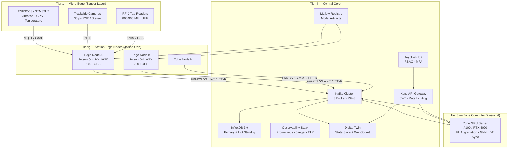

**Tier responsibilities:**

| Tier | Hardware | Role | Autonomy |
|------|----------|------|----------|
| 1 | ESP32-S3, STM32H7 | Signal conditioning, threshold alerting, MQTT publish | Independent |
| 2 | Jetson Orin NX/AGX | Local ML inference, 24h buffer, hardware telemetry | Full autonomous on disconnect |
| 3 | GPU server cluster | FL aggregation, zone GNN, Digital Twin sync | Zone-level |
| 4 | HPC cluster | Kafka brokers, InfluxDB, MLflow, observability, API gateway | Central |

---

## 2. IEC 62443 Zone Architecture

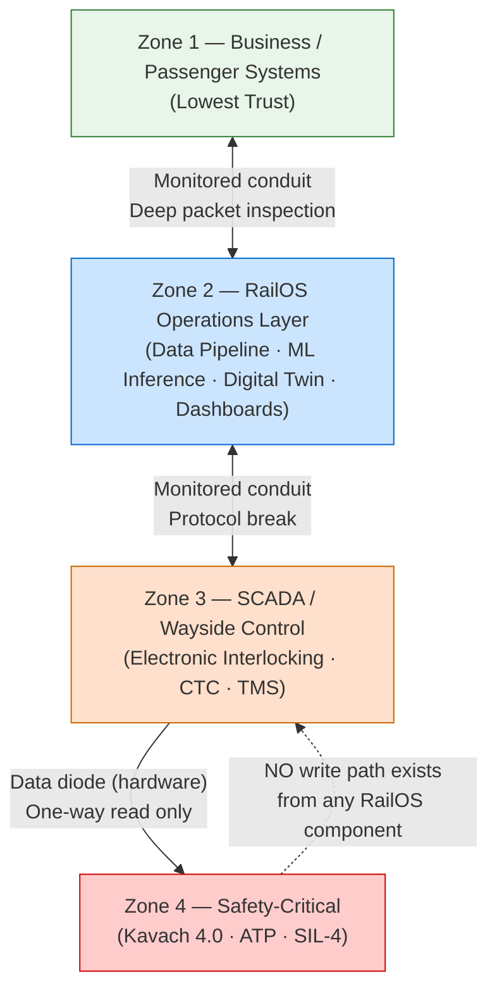

**Critical boundary**: A hardware data diode between Zone 3 and Zone 4 enforces one-way data flow. No
software path, API call, or advisory authorization event can write to Zone 4. The Kavach Advisory Layer
is deployed in Zone 2 and receives Kavach 4.0 telemetry via the data diode read tap. It has zero write
access to Zone 3 or Zone 4. (Satisfies Req 10, Req 12, Req 30.)

---

## 3. Communication Infrastructure

### 3.1 FRMCS / 5G-Advanced Network Slicing

| Slice | Latency | Availability | Traffic |
|-------|---------|--------------|---------|
| URLLC | < 1 ms user-plane | 99.999% | ETCS movement authorities, emergency brake commands |
| eMBB | High throughput | Best-effort | CCTV streams, cab video, diagnostic uploads |
| mIoT | Low power, high density | 99.9% | Track sensors, vibration, temperature, RFID |

Fallback chain: FRMCS 5G SA → LTE-R → GSM-R (legacy). Edge_Nodes must operate in autonomous mode
during connectivity gaps regardless of fallback state (Req 2, Req 33).

### 3.2 Time Synchronization (Req 27)

All subsystems synchronize via **PTP IEEE 1588** (grandmaster GPS-disciplined clock at zone compute node,
boundary clocks at each station Edge_Node). Maximum permitted drift: ±100 ms from UTC reference.

```
GPS Grandmaster (Zone Compute)
    └── PTP Boundary Clock (Station Edge Node A)
            └── PTP Ordinary Clock (Tier 1 Sensors)
    └── PTP Boundary Clock (Station Edge Node B)
            └── PTP Ordinary Clock (Tier 1 Sensors)
```

On drift > ±100 ms: emit `CLOCK_DRIFT_ALERT`, tag events `CLOCK_UNRELIABLE` until sync restored.

---

## 4. Data Pipeline Architecture

### 4.1 Kafka Topic Structure

```
track.sensor.vibration          # Accelerometer readings from track-mounted sensors
track.sensor.temperature        # Rail temperature readings
track.sensor.acoustic           # Acoustic emission for crack detection
train.telemetry.position        # GPS position + speed from locomotives
train.telemetry.omrs            # OMRS bearing health readings
train.telemetry.wild            # WILD wheel impact load readings
vision.defect.alerts            # DEFECT_ALERT events from Defect_Detector
vision.defect.gradcam           # Grad-CAM heatmap artifacts (by alert ID)
signaling.state                 # Electronic interlocking state (read-only tap)
maintenance.advisories          # MAINTENANCE_ADVISORY events
scheduling.proposals            # MARL_Scheduler rescheduling proposals
security.anomalies              # SECURITY_ANOMALY events
monitoring.alerts               # All system health alerts (FEED_UNAVAILABLE, etc.)
dead-letter.schema-failures     # Events that failed canonical schema validation
dead-letter.adapter-failures    # Events that failed legacy adapter parsing
audit.inference                 # ML inference audit records
audit.authorization             # Advisory authorization/rejection events
```

### 4.2 Stream Processing Pipeline

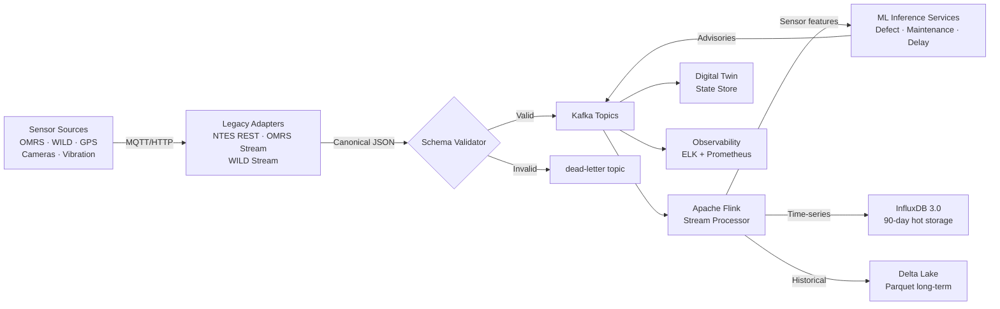

### 4.3 Canonical Sensor Event Schema

```json
{
  "eventId": "uuid-v4",
  "sourceId": "edge-node-scr-001",
  "sensorType": "vibration|temperature|gps|wheel_load|acoustic|camera",
  "assetId": "track-segment-scr-042|loco-12345",
  "timestamp_utc": "2026-06-10T14:23:01.456Z",
  "sequence": 1234567,
  "payload": {
    "values": [0.12, 0.34, 0.11],
    "unit": "g",
    "sampling_rate_hz": 1000
  },
  "quality_flags": {
    "interpolated": false,
    "interpolation_pct": 0.0,
    "clock_reliable": true,
    "drift_ms": 12.4
  },
  "schema_version": "1.0.0"
}
```

### 4.4 Legacy Adapter Pattern (Req 31)

Each adapter is an independently deployable service (separate container, separate Kafka producer):

```
NTES REST Adapter     → polls NTES HTTP API every 30s → normalizes to train.telemetry.position
OMRS Stream Adapter   → subscribes to OMRS proprietary stream → normalizes to train.telemetry.omrs
WILD Stream Adapter   → subscribes to WILD serial/TCP feed → normalizes to train.telemetry.wild
```

On 3 consecutive parse failures: emit `LEGACY_ADAPTER_FAILURE`, route raw payload to dead-letter topic.
Adapter version recorded in Prometheus label `adapter_version`. Replacing one adapter requires zero
Data_Pipeline restart (independent deployment unit).

---

## 5. Edge Node Architecture (Tier 2)

### 5.1 Hardware Specification

| Component | Spec |
|-----------|------|
| Compute | NVIDIA Jetson Orin NX 16GB (100 TOPS) or AGX Orin (200 TOPS) |
| Storage | 1 TB NVMe SSD (model weights + 24h event buffer + local audit log) |
| Connectivity | 5G/LTE-R modem + Ethernet (dual-path) |
| Power | 10–60W, UPS-backed at station |
| Operating system | Ubuntu 22.04 LTS, container runtime: containerd |

### 5.2 Heartbeat Watchdog FSM (Req 2, Req 33)

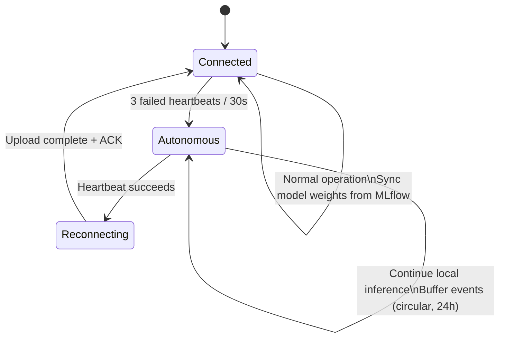

On `STORAGE_THRESHOLD` (90% capacity): SMS gateway → local console → audit log, retry every 5 min.

### 5.3 Hardware Telemetry (Req 44)

Sampled every 10 seconds, exposed as Prometheus metrics:

```
railos_edge_cpu_temp_celsius{node="scr-001"}
railos_edge_gpu_utilization_pct{node="scr-001"}
railos_edge_memory_utilization_pct{node="scr-001"}
railos_edge_storage_utilization_pct{node="scr-001"}
railos_edge_power_status{node="scr-001", status="nominal|degraded|failed"}
```

Thermal protection: on CPU/GPU temp > OEM threshold → throttle inference threads → emit
`THERMAL_PROTECTION_ACTIVE`. Restore full capacity only after 60 consecutive seconds below threshold.

---

## Components and Interfaces

## 6. ML Subsystem Designs

### 6.1 Track Defect Detector (Req 3, Req 18)

**Architecture**: YOLOv8n quantized to INT8 via TensorRT for Jetson deployment.

```
Input:  640×640 RGB frame (trackside camera, 30fps)
Backbone: YOLOv8n (3.2M params) → INT8 quantization via TensorRT
Output:
  - Bounding box coordinates [x, y, w, h]
  - Defect_Category: {crack, flaking, fastener_loose, spalling}
  - Confidence score [0.0, 1.0]
  - Grad-CAM heatmap (224×224 overlay, same latency budget)
  - Depth estimate (if stereo feed, ±5mm accuracy)

Latency budget: 100ms on Jetson Orin NX (INT8 TensorRT)
Training: Transfer learning from COCO → fine-tune on IR corridor defect dataset
Threshold: confidence < 0.70 → REQUIRES_HUMAN_REVIEW flag
```

**DEFECT_ALERT event schema:**

```json
{
  "alertId": "uuid-v4",
  "alertType": "DEFECT_ALERT",
  "timestamp_utc": "2026-06-10T14:23:01.456Z",
  "edgeNodeId": "scr-edge-001",
  "gps": {"lat": 17.3850, "lon": 78.4867},
  "defectCategory": "crack",
  "confidenceScore": 0.87,
  "requiresHumanReview": false,
  "depthMm": 3.2,
  "gradcamArtifactId": "uuid-v4-ref",
  "attribution": {
    "top3Features": [
      {"feature": "longitudinal_surface_discontinuity", "contribution": 0.61},
      {"feature": "edge_gradient_magnitude", "contribution": 0.24},
      {"feature": "texture_irregularity_score", "contribution": 0.15}
    ]
  },
  "modelVersion": "1.2.3",
  "driftWarning": false,
  "riskScore": 3.48,
  "riskTier": 1
}
```

### 6.2 Predictive Maintenance Engine (Req 4, Req 18)

**Architecture**: 2-layer LSTM with conformal prediction wrapper for calibrated confidence intervals.

```
Input:  30-minute rolling window × N sensors at 1Hz = 1800 timesteps × 8 features
        Features: [vibration_rms, vibration_kurtosis, vibration_peak,
                   temperature_bogie, wheel_load_left, wheel_load_right,
                   acoustic_emission_rms, speed_kmh]

Model:  LSTM(128) → LSTM(128) → Dense(64) → Dense(1, sigmoid)
        Dropout: 0.0 at inference (deterministic, EN 50128 compliant)
        Wrapped with MAPIE ConformalRegressor for calibrated CI

Output:
  - failure_probability: float [0.0, 1.0]
  - ci_lower: float, ci_upper: float (90% conformal prediction interval)
  - data_quality_pct: float (interpolated sample percentage)
  - attribution: SHAP values for top-3 features

CI width rule: width(p) ≥ width(0%) × (1 + p/20) for p ∈ (0%, 40%]
```

**MAINTENANCE_ADVISORY event schema:**

```json
{
  "alertId": "uuid-v4",
  "alertType": "MAINTENANCE_ADVISORY",
  "timestamp_utc": "2026-06-10T14:23:01.456Z",
  "assetId": "bogie-loco-12345-front-left",
  "failureProbability": 0.83,
  "horizonHours": 72,
  "ciLower": 0.76,
  "ciUpper": 0.91,
  "dataQualityPct": 8.5,
  "attribution": {
    "top3Features": [
      {"feature": "vibration_kurtosis", "contribution": 0.54},
      {"feature": "wheel_load_left", "contribution": 0.31},
      {"feature": "temperature_bogie", "contribution": 0.15}
    ]
  },
  "modelVersion": "2.1.0",
  "driftWarning": false,
  "riskScore": 2.49,
  "riskTier": 2
}
```

### 6.3 GNN Delay Predictor (Req 5, Req 18)

**Architecture**: HetGNN using GraphSAGE with heterogeneous node types.

```
Graph structure:
  Node types:
    - Station: {stationId, name, platform_count, current_occupancy}
    - Train:   {trainId, type, current_delay_min, load_factor, schedule_adherence}
    - Segment: {segmentId, length_km, speed_limit, current_occupancy}
  Edge types:
    - Train→Station: (train occupies station)
    - Station→Segment: (station connects to segment)
    - Train→Train: (trains sharing headway constraint)

Model: HetGNN-SAGE
  - 2 message-passing layers, 128 hidden units per node type
  - Heterogeneous linear transformations per edge type
  - Output: per-Train node → delay point estimate + conformal PI bounds

Training: 2+ years NTES historical data, 80/20 train/test split by timestamp
Inference: updated every 5 minutes on fresh NTES snapshot, 2s latency budget
```

REST endpoint (Req 5, Req 24):
- `POST /api/v1/delay-predictor/forecast`
- Request: corridor snapshot JSON (train positions, delay states, timestamp)
- Response: per-train forecasts with point estimate + 90% PI + `STALE_INPUT` flag if applicable
- Error: HTTP 400 with structured field-level error body on malformed input

### 6.4 Federated Learning Layer (Req 6, Req 13)

**Framework**: Flower (flwr) 1.x with FedAvg strategy and Opacus differential privacy.

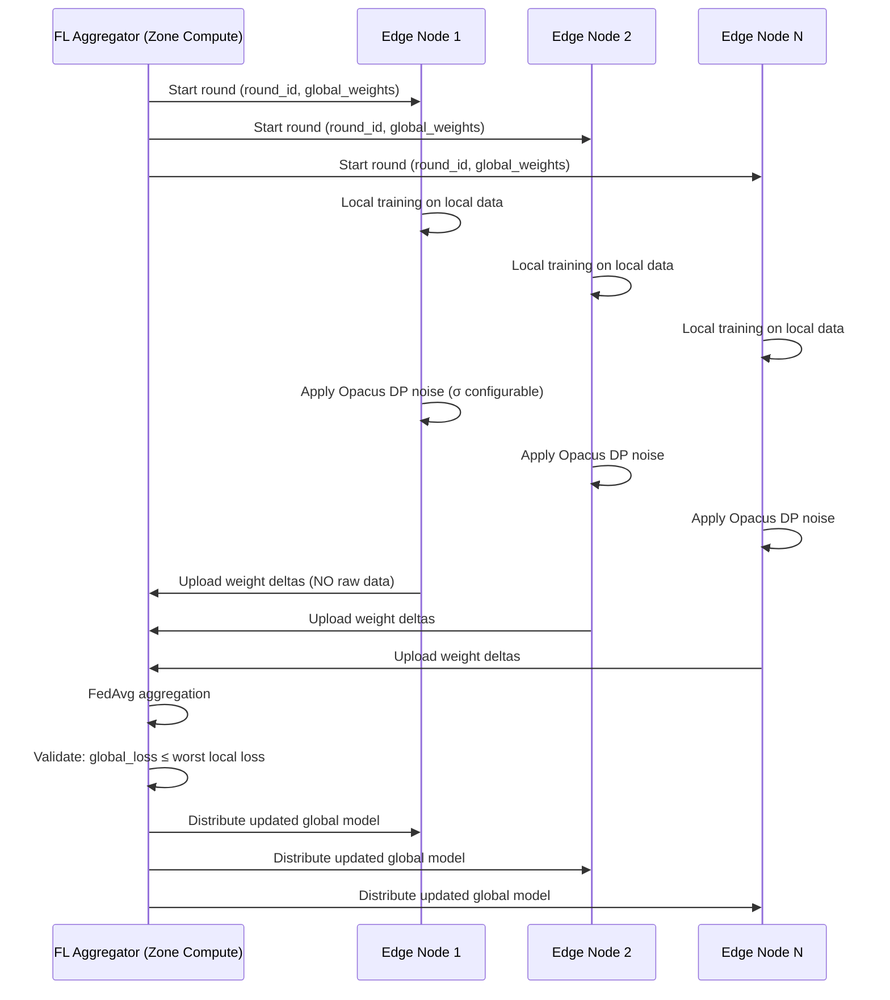

Round rules: 120s timeout per client. Minimum 3 responding clients to proceed.
Below 3: abort round, emit `ROUND_ABORTED`, retain previous global model.
New node join: initialize with current global weights before first round participation.

### 6.5 MARL Train Scheduler (Req 7)

**Environment**: Flatland-RL configured for Corridor topology (stations, segments, trains).

```
State:  Per-agent (train): {position, speed, delay, destination, remaining_path}
        Global: {segment_occupancy_map, active_disruptions}
Action: Per-agent: {hold, advance, reroute_via_alternative, short_turn}
Reward: Minimize total passenger delay × safety penalty for any Conflict

Algorithm: PPO (Stable Baselines3)
  - Actor: MLP(256, 256)
  - Critic: MLP(256, 256)
  - Entropy coefficient: 0.01

Conflict-free constraint layer:
  - Post-processes every proposed action set
  - Checks segment occupation time windows for overlap
  - Rejects any action that creates a Conflict before output
  - Guarantees: ∀ proposal output, no two trains share segment at overlapping times

Timeout: 30s hard limit → emit NO_FEASIBLE_PROPOSAL within 35s
Rejection loop: alternative proposal must differ in assignment pattern from rejected proposal
3 consecutive rejections → SCHEDULING_ESCALATION event
```

**Rescheduling proposal schema:**

```json
{
  "proposalId": "uuid-v4",
  "disruptionEventId": "uuid-v4-ref",
  "timestamp_utc": "2026-06-10T14:23:01.456Z",
  "conflictFree": true,
  "assignments": [
    {
      "trainId": "12345",
      "actions": [
        {"segmentId": "scr-seg-042", "enterAt": "14:24:00", "exitAt": "14:31:00"},
        {"segmentId": "scr-seg-043", "enterAt": "14:32:00", "exitAt": "14:40:00"}
      ],
      "delayDeltaMin": -8
    }
  ],
  "totalPassengerDelayMin": 142,
  "riskScore": 1.8,
  "riskTier": 3,
  "modelVersion": "3.0.1"
}
```

### 6.6 Cybersecurity LSTM Autoencoder (Req 9, Req 26)

```
Architecture: LSTM Autoencoder
  Encoder: LSTM(128) → LSTM(64) → latent vector
  Decoder: LSTM(64) → LSTM(128) → Dense(input_dim)
  Training: normal SCADA traffic only (anomaly-free baseline)
  Anomaly signal: reconstruction MSE > configurable threshold

Input:  60-second SCADA traffic window, stride 10s (50s overlap)
        Features: packet_rate, query_type_distribution, inter-arrival_times,
                  payload_size_histogram, source_IP_entropy

Output: anomaly_flag, reconstruction_error, temporal_attention_weights (forensic)
Forensic: raw 60s window + error vector stored to WORM S3 on any anomaly
```

### 6.7 Kavach++ Advisory Layer (Req 10)

```
Input (read-only tap via data diode):
  - Current train speed (km/h) from Kavach 4.0 telemetry
  - Track gradient from DEM lookup (GPS coordinate → elevation model)
  - Wheel-rail adhesion estimate from bogie vibration pattern (1D-CNN classifier)

Physics model:
  stopping_distance = v² / (2 × μ × g × cos(θ) + 2 × g × sin(θ))
  where:
    v     = current speed (m/s)
    μ     = estimated adhesion coefficient (0.1–0.35)
    g     = 9.81 m/s²
    θ     = track gradient angle

Safety invariant:
  advisory_stopping_distance(v) ≥ kavach_certified_stopping_distance(v)
  ∀ v ∈ [0, v_max]

Label: ALL outputs carry "ADVISORY — NOT CERTIFIED" in payload metadata and UI
Network: deployed in Zone 2, ZERO write path to Zone 3 or Zone 4
```

---

## 7. Digital Twin Architecture (Req 8, Req 21, Req 45)

### 7.1 Five-Layer Stack

```
Layer A: Asset Data Model
  - IFC 4.x BIM models for stations, bridges, tunnels
  - Asset registry in PostgreSQL: {assetId, type, location_geojson, spec_version, maintenance_history}
  - OpenStreetMap + IR GIS data for track geometry (PostGIS LineString, EPSG:4326)

Layer B: Geospatial Layer
  - PostGIS for spatial queries (nearest asset to GPS coordinate, segment geometry)
  - Track topology graph: directed graph of segments and junctions

Layer C: Real-Time State Store
  - InfluxDB 3.0: current train positions, sensor readings, alert states
  - Kafka consumer group: subscribes to all advisory and telemetry topics
  - State conflict detector: rejects updates violating track topology invariants

Layer D: Simulation Engine
  - OpenTrack: physics-based train dynamics (braking curves, energy, timetable)
  - SimPy: discrete-event timetable simulation for what-if scenarios
  - MARL_Scheduler integration: simulation mode for proposal visualization

Layer E: Visualization
  - Three.js (3D scene) + Deck.gl (GIS layers) + React frontend
  - WebSocket push from state store (≤5s position refresh)
  - Visual encoding convention (see 7.2)
```

### 7.2 Visual Encoding Convention (Req 45)

| State | Visual Encoding | Color |
|-------|----------------|-------|
| Confirmed (live sensor data) | Solid marker, opaque fill | Per severity |
| Predicted (ML forecast) | Dashed border, semi-transparent fill, "PREDICTED" label | Blue-tinted |
| Simulated (MARL/OpenTrack) | Hatched fill pattern, "SIMULATED" label | Grey-tinted |
| Stale (>10s no update) | Faded opacity + staleness icon | Amber overlay |
| Advisory (Kavach++) | Read-only panel, "ADVISORY — NOT CERTIFIED" banner | Yellow panel |

A persistent legend panel is always visible, defining all encoding conventions (Req 45 C4).

Delay forecast overlay: renders 90% PI band as shaded corridor along train path (Req 5 C1).
Failure probability overlay: confidence interval bar alongside asset marker (Req 4 C2).

### 7.3 State Conflict Detection

```python
# Pseudo-code: reject topology-violating updates
def validate_state_update(update: TrainPositionUpdate, topology: TrackGraph) -> bool:
    segment = topology.get_segment(update.position)
    if segment is None:
        log_inconsistency(update)  # position outside known track topology
        return False
    occupants = state_store.get_occupants(segment.id, update.timestamp)
    if len(occupants) >= segment.max_concurrent_trains:
        log_inconsistency(update)  # two trains on same segment
        return False
    return True
```

---

## 8. Observability Stack (Req 17, Req 25, Req 44)

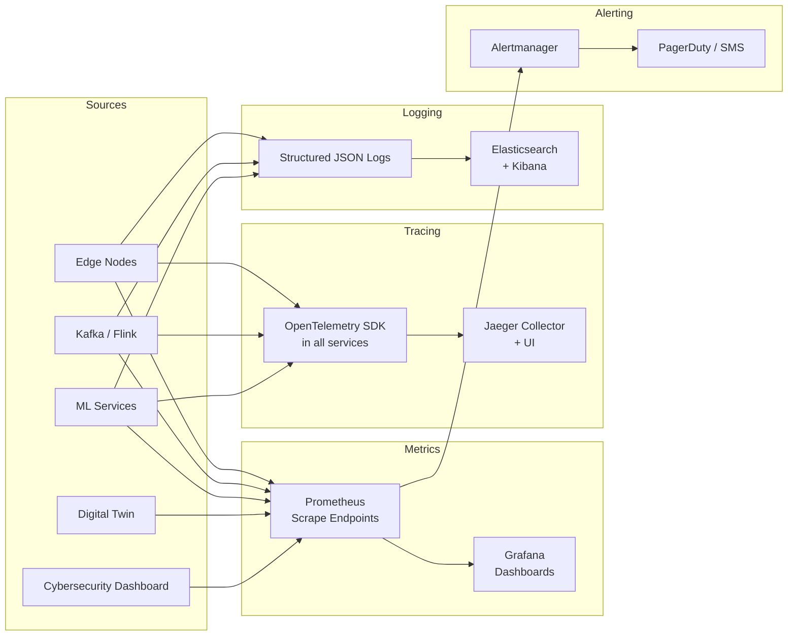

**Key Prometheus metrics for end-to-end latency (Req 25):**

```
railos_alert_e2e_latency_seconds{alert_type="DEFECT_ALERT", quantile="0.5|0.95|0.99"}
railos_alert_e2e_latency_seconds{alert_type="MAINTENANCE_ADVISORY", ...}
railos_pipeline_normalization_latency_ms{node="scr-001"}
railos_ml_inference_latency_ms{model="defect_detector", node="scr-001"}
railos_authorization_gate_status{status="operational|degraded|unavailable"}
railos_subsystem_error_rate{subsystem="data_pipeline|delay_predictor|..."}
```

Trace span chain for end-to-end alert (must complete in ≤5s, Req 25):
```
sensor_ingest_edge → kafka_publish → flink_process → ml_inference → advisory_emit
→ kafka_consume_dt → digital_twin_render → websocket_push → browser_render
```

---

## 9. Security Architecture (Req 23, Req 24, Req 38, Req 39)

### 9.1 RBAC and Authentication

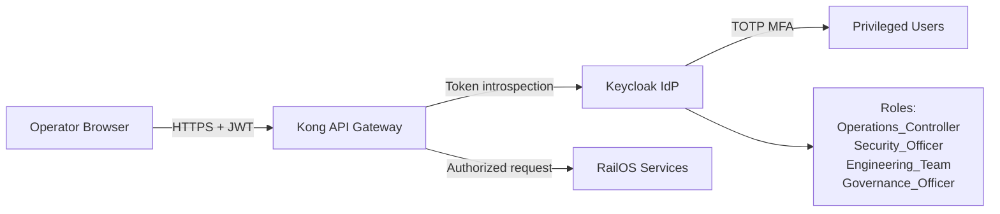

Role permission matrix:

| Action | Ops_Controller | Security_Officer | Engineering_Team | Governance_Officer |
|--------|---------------|-----------------|-----------------|-------------------|
| View/authorize advisories | ✓ | — | — | — |
| Acknowledge security anomalies | — | ✓ | — | — |
| View audit logs | — | ✓ | ✓ | ✓ |
| Deploy/rollback models | — | — | ✓ | — |
| Configure drift thresholds | — | — | ✓ | — |
| Request data lineage reports | — | — | — | ✓ |
| Configure retention policies | — | — | — | ✓ |
| Place/release forensic holds | — | ✓ | — | ✓ |

### 9.2 API Gateway (Req 24)

Kong Gateway configuration:
- JWT validation plugin (RS256, JWKS from Keycloak)
- Rate limiting plugin: 1,000 req/min per client → HTTP 429 + `Retry-After`
- Request transformer: inject `X-Trace-ID` from OpenTelemetry span
- Versioned routing: `/api/v1/` prefix, breaking changes require `/api/v2/`

### 9.3 Container Security (Req 39)

Kubernetes Pod Security Admission — `restricted` profile:
```yaml
securityContext:
  runAsNonRoot: true
  runAsUser: 1000
  readOnlyRootFilesystem: true   # where operationally feasible
  allowPrivilegeEscalation: false
  capabilities:
    drop: ["ALL"]
    add: []   # only add explicitly required capabilities
```

Runtime anomaly detection: Falco monitors container syscall patterns.
`PRIVILEGE_ESCALATION_ALERT` → Security_Officer → terminate container within 30s.

### 9.4 Supply Chain Security (Req 38)

```
Build pipeline:
  1. Source code → GitHub Actions CI
  2. Container build → cosign sign (Sigstore) → push to registry
  3. Syft generates SBOM (CycloneDX JSON) per image
  4. Grype scans SBOM against NVD → blocks build on HIGH/CRITICAL CVE
  5. On deployment: cosign verify signature before kubectl apply
  6. NVD feed polled every 24h → CVE_ALERT if active SBOM component affected
```

### 9.5 Forensic Storage (Req 26)

```
Provider: MinIO with Object Lock (WORM mode, COMPLIANCE governance)
Bucket:   railos-forensic-evidence
Policy:   append-only, retention 365 days minimum, no delete/overwrite
Content:  {alertId}.tar.gz containing:
  - raw_traffic_window.pcap (60s SCADA capture)
  - reconstruction_error_vector.json
  - alert_metadata.json
  - audit_log_entries.jsonl (all events linked to alertId)
```

---

## 10. Disaster Recovery and Availability (Req 15, Req 16)

### 10.0 Energy Efficiency Design (Req 22)

Edge_Node power management operates as a two-state adaptive scheduler:

```
Normal load (≥10% rated capacity):   All inference threads active, full GPU clock
Low load (<10% for ≥5 min):          Reduce active TensorRT inference threads from N to max(1, N/2)
                                       Apply Jetson power mode: switch from MAXN to 15W mode
                                       Target: ≥20% reduction in measured watt-hour consumption

Restore trigger:  New inference request arrives →
                  jetson_clocks --restore within 500ms → full capacity resumed

Power metric exposed (Req 17, Req 22):
  railos_edge_inference_ops_per_wh{node="scr-001"}   # rolling 24h
  railos_edge_power_mode{node="scr-001", mode="maxn|15w|10w"}
  railos_edge_power_restore_latency_ms{node="scr-001"}
```

Corridor-level energy efficiency aggregation: Flink job aggregates per-node
`inference_ops_per_wh` metrics from all Edge_Nodes via Prometheus federation every 24h,
writes summary to InfluxDB `corridor_energy_efficiency` measurement, accessible via
the observability telemetry endpoint (Req 22 C2).

### 10.1 Primary Infrastructure Topology

| Component | HA Configuration | RPO | RTO |
|-----------|-----------------|-----|-----|
| Kafka | 3 brokers, RF=3, min.insync.replicas=2 | 0 | < 30s (leader election) |
| InfluxDB 3.0 | Primary + hot standby, continuous WAL replication | 60s | < 5 min |
| PostgreSQL (audit, hazard register, config) | Patroni HA (primary + 2 replicas) | 60s | < 2 min |
| MLflow | Primary + read replica, artifact storage on geo-replicated S3 | 60s | < 30 min |
| Edge_Nodes | 24h autonomous operation, local NVMe buffer | N/A (local) | Immediate |

### 10.2 Backup and Recovery

- Daily automated backup of all PostgreSQL databases to geographically separate storage node
- WAL streaming replication: 60s max lag (RPO ≤ 60s, Req 16 C2)
- Daily automated restore integrity test to isolated test environment
- `BACKUP_INTEGRITY_FAILURE` alert if restore test fails
- Full system restore target: 30 minutes from catastrophic failure (RTO ≤ 30 min, Req 16 C1)

### 10.3 Geographic Failure Isolation (Req 41)

The Corridor is partitioned into N geographic isolation zones, each covering a contiguous set of stations
managed by a dedicated Edge_Node cluster. Isolation is enforced at the Kafka topic level (per-zone topic
partitions) and the Flink job level (per-zone processing units). A failure in zone `scr-north` triggers
`SUBSYSTEM_DEGRADED` alerts only for that zone's topics; all other zones continue at full capacity.

---

## 10.4 Data Retention Lifecycle Engine (Req 28)

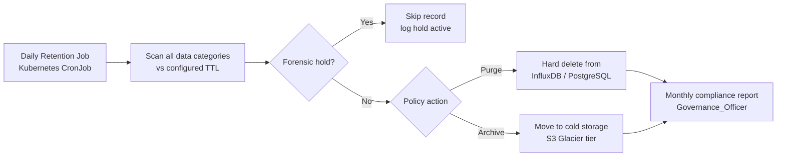

Retention policies (defaults, all configurable in HashiCorp Vault per Req 37):

| Category | Default TTL | Action |
|----------|-------------|--------|
| Raw sensor events | 90 days | Archive to Delta Lake cold tier |
| Inference audit logs | 365 days | Archive |
| Security anomaly records | 365 days | Archive |
| Forensic evidence | 365 days | Archive (never purge while hold active) |
| Telemetry metrics | 30 days | Purge from Prometheus TSDB |
| Model artifacts | Indefinite | Manual delete by Engineering_Team only |

Forensic hold API: `POST /api/v1/retention/holds` (Security_Officer or Governance_Officer role)
sets a hold record in PostgreSQL `forensic_holds` table; the daily retention job joins against
this table before any archive/purge decision (Req 28 C2, C4).

Monthly compliance report produced by a Flink batch job on the first day of each month:
records archived/purged per category, overdue records, current storage bytes per category.
Delivered to Governance_Officer via the operations notification channel (Req 28 C3).

---

## 10.5 Simulation Validation Design (Req 32)

Validation runs as a mandatory pre-deployment gate (executed by the CI/CD pipeline in §11):

**Digital Twin validation:**
```
Input dataset:  30-day held-out IR historical movement records (NTES archive)
Evaluation:     For each historical train trajectory, replay through OpenTrack simulation
Metric:         Mean Absolute Position Error (MAPE) = mean(|sim_pos - actual_pos|) in metres
Gate:           MAPE ≤ 500m at all trajectory points
Storage:        Result written to traceability matrix with dataset_version_id and PASS/FAIL
```

**MARL_Scheduler validation:**
```
Input dataset:  100 historical disruption scenarios reconstructed from NTES archive
                (minimum: 30 cancelled-service, 40 delayed-service, 30 blocked-segment scenarios)
Evaluation:     Run MARL_Scheduler on each scenario with 30s time limit
Metric:         Conflict-free proposal rate = (proposals within 30s with conflictFree=true) / 100
Gate:           Rate ≥ 70%
Storage:        Per-scenario results + aggregate rate written to model governance audit log
                with dataset_version_id and PASS/FAIL status before deployment approval
```

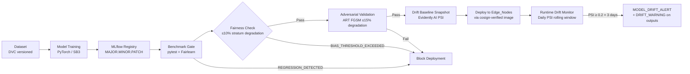

**Dataset governance (DVC):** every dataset version tagged with source identifiers, preprocessing steps,
annotation tool version, timestamp range, and approving Engineering_Team member. Linked to model version
in traceability matrix (Req 35, Req 42).

**Configuration versioning (Req 37):** HashiCorp Vault stores all thresholds, suppression windows, and
deployment parameters. Vault audit device records immutable change log (key, prev_value, new_value,
identity, timestamp). Vault policies enforce role-based config modification rights.

---

## 12. Human-in-the-Loop Authorization Gate (Req 12, Req 30)

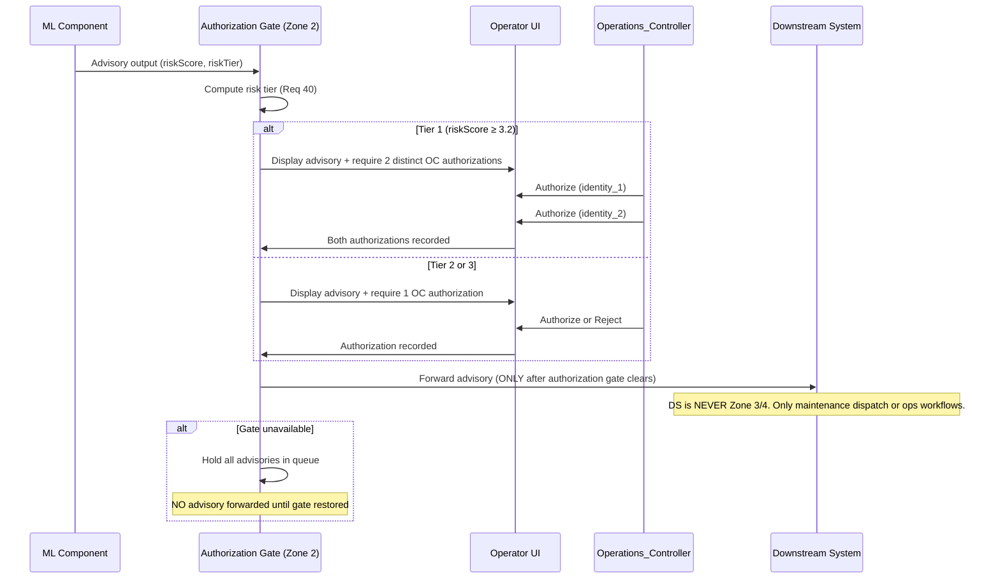

Advisory authorization audit record schema:

```json
{
  "auditId": "uuid-v4",
  "advisoryId": "uuid-v4-ref",
  "action": "AUTHORIZE | REJECT",
  "controllerIdentity": "oc-user-id",
  "controllerIdentity2": "oc-user-id-2",
  "timestamp_utc": "2026-06-10T14:23:01.456Z",
  "riskTier": 1,
  "riskScore": 3.48,
  "advisoryType": "DEFECT_ALERT",
  "modelVersion": "1.2.3",
  "configVersion": "vault-seq-00421"
}
```

---

## Data Models

### 12.1 Canonical Sensor Event

```json
{
  "eventId": "uuid-v4",
  "sourceId": "edge-node-scr-001",
  "sensorType": "vibration|temperature|gps|wheel_load|acoustic|camera",
  "assetId": "track-segment-scr-042|loco-12345",
  "timestamp_utc": "2026-06-10T14:23:01.456Z",
  "sequence": 1234567,
  "payload": {
    "values": [0.12, 0.34, 0.11],
    "unit": "g",
    "sampling_rate_hz": 1000
  },
  "quality_flags": {
    "interpolated": false,
    "interpolation_pct": 0.0,
    "clock_reliable": true,
    "drift_ms": 12.4
  },
  "schema_version": "1.0.0"
}
```

See also: DEFECT_ALERT schema in §6.1, MAINTENANCE_ADVISORY schema in §6.2,
SECURITY_ANOMALY and rescheduling proposal schemas in §6.5–6.6, and authorization
audit record in §12.

## 13. Safety and Compliance Architecture (Req 35, Req 36, Req 37)

### 13.1 Traceability Matrix

Stored as structured JSON in PostgreSQL, linked to MLflow run IDs:

```json
{
  "traceId": "uuid-v4",
  "requirementId": "REQ-003",
  "hazardIds": ["HAZ-012", "HAZ-017"],
  "mitigations": ["MT-003-A: confidence threshold gate", "MT-003-B: human review escalation"],
  "evidenceRecords": [
    {
      "evidenceId": "uuid-v4",
      "type": "benchmark_result",
      "mlflowRunId": "abc123",
      "subsystemVersion": "1.2.3",
      "result": "PASS",
      "timestamp_utc": "2026-06-10T10:00:00Z"
    }
  ],
  "deployedVersion": "1.2.3"
}
```

### 13.2 Hazard Register Schema

PostgreSQL table with immutable revision history:

```sql
CREATE TABLE hazard_register (
  revision_id     UUID PRIMARY KEY DEFAULT gen_random_uuid(),
  hazard_id       VARCHAR(20) NOT NULL,
  description     TEXT NOT NULL,
  subsystem       VARCHAR(100) NOT NULL,
  likelihood      VARCHAR(10) CHECK (likelihood IN ('Low','Medium','High')),
  severity        VARCHAR(15) CHECK (severity IN ('Minor','Major','Catastrophic')),
  residual_risk   VARCHAR(15),
  mitigation      TEXT NOT NULL,
  evidence_ref    UUID REFERENCES traceability_matrix(trace_id),
  approval_status VARCHAR(15) CHECK (approval_status IN ('Open','Mitigated','Accepted','Closed')),
  created_at      TIMESTAMPTZ NOT NULL DEFAULT NOW(),
  created_by      VARCHAR(100) NOT NULL
  -- No UPDATE or DELETE permitted on this table (append-only via trigger)
);
```

---

## 14. Operator Alert Fatigue Management (Req 29, Req 34)

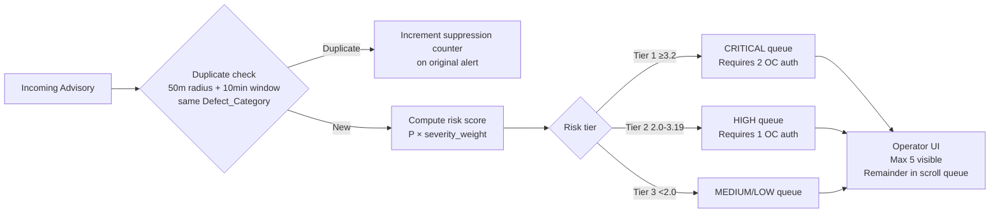

UI constraints (Req 34):
- Maximum 5 advisories visible in primary panel; overflow in scrollable queue with count badge
- All interactive controls minimum 44×44 CSS pixels
- Severity colors: RED=CRITICAL, AMBER=HIGH, YELLOW=MEDIUM, BLUE=LOW
- High-contrast mode and reduced-motion mode accessible from settings (no session restart)
- WCAG 2.1 Level AA compliance for all operator-facing interfaces

---

## Correctness Properties

### Property 1: MARL Proposals Are Always Conflict-Free

**Validates: Requirements 7.2**

For all disruption inputs, every rescheduling proposal emitted by the MARL_Scheduler must be free of Conflicts — no two trains assigned to the same track segment at overlapping times.

### Property 2: Kavach Advisory Is Never Less Conservative Than Certified Curve

**Validates: Requirements 10.3**

For all speed values and track conditions, the advisory stopping distance must be greater than or equal to the certified Kavach 4.0 stopping distance.

### Property 3: Federated Learning Global Model Is Not Worse Than Worst Local Model

**Validates: Requirements 6.2**

After each aggregation round, the global model's validation loss on any participating node's held-out set must not exceed the highest local validation loss observed in that round.

### Property 4: Confidence Interval Widens Monotonically With Interpolation Rate

**Validates: Requirements 4.6**

For any asset and window, the output confidence interval width at interpolation percentage p must be at least (1 + p/20) times the baseline width at p=0%.

### Property 5: Risk Score Is Always in [0.0, 4.0]

**Validates: Requirements 40.1**

For all advisory outputs, the computed risk score must be a finite value in the closed interval [0.0, 4.0].

### Property 6: No Advisory Reaches Downstream Without Authorization Record

**Validates: Requirements 12.1, 30.1**

For all advisory outputs, no downstream system receives a forwarded advisory unless the audit log contains a corresponding authorize action from an Operations_Controller.

### Property 7: Delay Predictor MAE Degradation Is Within 15% Across Data Reduction

**Validates: Requirements 5.4**

The mean absolute error on the held-out test set when training on 3 months of data must not exceed the 12-month baseline MAE by more than 15%.

## 15. Key Correctness Properties (Property-Based Tests)

All properties implemented using **Hypothesis** (Python PBT library). (Satisfies Req 7, Req 10, Req 6, Req 4, Req 40, Req 12, Req 5.)

```python
# Property 1: MARL proposals are always Conflict-free (safety invariant)
@given(disruption_events())
def test_marl_conflict_free(disruption):
    proposal = marl_scheduler.propose(disruption)
    assert is_conflict_free(proposal), "Two trains assigned to same segment at overlapping times"

# Property 2: Kavach advisory never less conservative than certified curve
@given(speeds_kmh(min=0, max=160), track_conditions())
def test_kavach_advisory_conservative(speed, conditions):
    advisory_dist = kavach_advisory.stopping_distance(speed, conditions)
    certified_dist = kavach_4.stopping_distance(speed, conditions)
    assert advisory_dist >= certified_dist

# Property 3: FL global model ≤ worst local model validation loss
@given(federated_round_data(min_clients=3))
def test_fl_global_not_worse_than_worst_local(round_data):
    global_loss = fl_layer.aggregate(round_data)
    worst_local = max(client.local_val_loss for client in round_data.clients)
    assert global_loss <= worst_local + TOLERANCE

# Property 4: Confidence interval widens monotonically with interpolation rate
@given(interpolation_pcts(min=0.0, max=40.0), asset_windows())
def test_ci_widens_with_interpolation(p, window):
    ci_base = predictive_engine.predict(window, interpolation_pct=0.0).ci_width
    ci_p    = predictive_engine.predict(window, interpolation_pct=p).ci_width
    assert ci_p >= ci_base * (1 + p / 20)

# Property 5: Risk score always in [0.0, 4.0]
@given(advisory_outputs())
def test_risk_score_bounds(advisory):
    assert 0.0 <= advisory.risk_score <= 4.0

# Property 6: No advisory reaches downstream without authorization record
@given(advisory_outputs())
def test_no_advisory_without_auth(advisory):
    gate.receive(advisory)
    # Without an authorization action, downstream should never receive the advisory
    assert downstream.received_count() == 0
    gate.authorize(advisory.id, controller_id="oc-001")
    assert downstream.received_count() == 1

# Property 7: Delay predictor MAE degradation ≤15% from 12mo → 3mo training data
def test_delay_predictor_graceful_degradation():
    mae_12mo = evaluate_delay_predictor(training_months=12)
    mae_3mo  = evaluate_delay_predictor(training_months=3)
    assert mae_3mo <= mae_12mo * 1.15
```

---

## 16. Technology Stack Summary

| Layer | Component | Technology | Requirements |
|-------|-----------|-----------|-------------|
| Communication | Railway radio | FRMCS 5G-Advanced (URLLC/eMBB/mIoT slices) | Req 1, 2 |
| Communication | Time sync | PTP IEEE 1588, GPS-disciplined NTP | Req 27 |
| Micro-edge | Sensor MCU | ESP32-S3, STM32H7, Nordic nRF9160 | Req 1 |
| Edge compute | AI accelerator | NVIDIA Jetson Orin NX/AGX | Req 2, 3, 4 |
| Edge inference | Vision model | YOLOv8n + TensorRT INT8 | Req 3, 18 |
| Edge inference | Time-series model | LSTM/GRU + TF Lite (fallback) | Req 4 |
| Data pipeline | Event streaming | Apache Kafka 3.x (3 brokers, RF=3) | Req 1, 33 |
| Data pipeline | Stream processing | Apache Flink | Req 1, 5 |
| Data pipeline | Time-series DB | InfluxDB 3.0 (Parquet-backed) | Req 1, 16 |
| Data pipeline | Historical store | Apache Delta Lake (Parquet) | Req 13, 28 |
| ML training | Framework | PyTorch 2.x | Req 3–7 |
| ML training | GNN | PyTorch Geometric (GraphSAGE) | Req 5 |
| ML training | RL | Stable Baselines3 + Flatland-RL | Req 7 |
| ML training | Federated learning | Flower (flwr) + Opacus DP | Req 6, 13 |
| ML explainability | Feature attribution | SHAP (Predictive), Grad-CAM (Vision) | Req 18 |
| ML governance | Model registry | MLflow | Req 11, 42 |
| ML governance | Drift detection | Evidently AI (PSI) | Req 20 |
| ML governance | Fairness eval | Fairlearn | Req 19 |
| ML governance | Adversarial testing | ART (Adversarial Robustness Toolbox) | Req 43 |
| ML governance | Dataset versioning | DVC | Req 42 |
| Digital twin | 3D visualization | Three.js + Deck.gl + React | Req 8, 45 |
| Digital twin | GIS/spatial | PostGIS (PostgreSQL) | Req 8, 21 |
| Digital twin | Simulation | OpenTrack + SimPy | Req 32 |
| Digital twin | Real-time state | InfluxDB + WebSocket | Req 8, 21 |
| Observability | Metrics | Prometheus + Grafana | Req 17, 25, 44 |
| Observability | Tracing | OpenTelemetry + Jaeger | Req 17, 25 |
| Observability | Logging | Structured JSON → Elasticsearch + Kibana | Req 17 |
| Observability | Alerting | Alertmanager → PagerDuty/SMS | Req 15, 17 |
| Security | Identity/RBAC | Keycloak (OIDC, TOTP MFA) | Req 23 |
| Security | API gateway | Kong Gateway | Req 24 |
| Security | Container runtime | Kubernetes + Falco | Req 39 |
| Security | Supply chain | cosign + Syft + Grype | Req 38 |
| Security | Forensic storage | MinIO Object Lock (WORM) | Req 26 |
| Safety/compliance | Traceability | PostgreSQL + MLflow linkage | Req 35 |
| Safety/compliance | Hazard register | PostgreSQL (append-only) | Req 36 |
| Safety/compliance | Config versioning | HashiCorp Vault | Req 37 |
| Safety/compliance | PBT | Hypothesis | Req 7, 10, 6, 4, 40, 12, 5 |
| Database | Audit/governance logs | PostgreSQL + Patroni HA | Req 11–13, 26, 28 |
| Infrastructure | Container orchestration | Kubernetes | Req 15, 16, 39 |
| Infrastructure | Secrets management | HashiCorp Vault | Req 23, 37 |
| Infrastructure | Backup/DR | Automated snapshots + WAL streaming | Req 16 |

---

## Error Handling

### Sensor Feed Failures
- Feed silent >10s → `FEED_UNAVAILABLE` alert, pipeline continues on remaining feeds
- Schema validation failure → dead-letter topic, `SCHEMA_VALIDATION_FAILURE` alert, event not forwarded
- InfluxDB write failure → 3 retries with exponential back-off, `STORAGE_WRITE_FAILURE` on exhaustion

### Edge Node Failures
- 3 heartbeat failures in 30s → autonomous mode, local inference continues from cached models
- Buffer full during disconnect → circular overwrite with overflow log entry
- Thermal threshold exceeded → inference throttle + `THERMAL_PROTECTION_ACTIVE`, restore after 60s

### ML Inference Failures
- Interpolation >40% in PME window → withhold score, emit `INSUFFICIENT_DATA`
- NTES feed stale >60s → use last snapshot, flag all outputs `STALE_INPUT`
- FL round below 3 clients → abort round, emit `ROUND_ABORTED`, retain previous model
- Model rollback with no prior version → immediate `NO_PREVIOUS_VERSION` rejection

### Advisory and Authorization Failures
- Authorization gate unavailable → hold all advisories in queue, no forwarding until gate restored
- No secondary controller available for escalation → `ESCALATION_FAILED` alert to supervisor channel
- MARL cannot find conflict-free proposal in 30s → `NO_FEASIBLE_PROPOSAL` within 35s
- 3 consecutive proposal rejections → `SCHEDULING_ESCALATION`, request manual timetabling

### Security and Infrastructure Failures
- Container privilege escalation detected → `PRIVILEGE_ESCALATION_ALERT`, terminate container in 30s
- Supply chain checksum mismatch → block deployment, `SUPPLY_CHAIN_INTEGRITY_FAILURE` alert
- Backup integrity test failure → `BACKUP_INTEGRITY_FAILURE` alert to engineering channel
- CVE in active SBOM component → `CVE_ALERT` to Engineering_Team within 24h of NVD publication

### Clock and Network Failures
- Clock drift >±100ms → `CLOCK_DRIFT_ALERT`, tag events `CLOCK_UNRELIABLE` until sync restored
- Network partition → edge autonomous mode per Req 2; on resolution, timestamp-ordered reconciliation
- Zone isolation failure cascade → zone-isolated degraded mode for affected zone only (Req 41)

---

## Testing Strategy

### Unit Tests
- Each ML model component tested in isolation with synthetic inputs covering boundary conditions
- Canonical schema serialization/deserialization round-trip tests
- Legacy adapter parsers tested against recorded real-format payloads (NTES, OMRS, WILD)
- Authorization gate tested for forwarding behavior with/without authorization records

### Integration Tests
- Kafka → Flink → InfluxDB pipeline tested with synthetic sensor bursts at 10,000 events/s
- Edge_Node autonomous mode: simulate heartbeat failure and verify local inference continuity
- Digital Twin state conflict detection: inject topology-violating updates, assert rejection
- FL round protocol: simulate client timeouts, verify 3-client minimum enforcement

### Property-Based Tests (Hypothesis)
See §15 Correctness Properties for all 7 PBT invariants covering:
- MARL conflict-free guarantee
- Kavach advisory conservatism
- FL global model quality bound
- CI monotonic widening
- Risk score bounds
- Authorization gate enforcement
- Delay predictor graceful degradation

### Performance Tests
- End-to-end alert latency: load test at 200 trains + 50 sensor feeds, measure p50/p95/p99
- Defect detector inference: verify 100ms budget on Jetson Orin NX under sustained 30fps input
- Kafka throughput: sustained 10,000 events/s ingestion test over 60 minutes

### Simulation Validation Tests (Req 32)
- Digital Twin vs 30-day historical IR movement data: mean absolute position error ≤500m
- MARL_Scheduler on 100 historical disruption scenarios: ≥70% conflict-free proposals in 30s

### Red-Team / Adversarial Tests (Req 43)
- Cybersecurity LSTM autoencoder: inject synthetic SCADA adversarial patterns in simulation mode
  — target: ≥80% detection rate within 60s evaluation window
- ML models: FGSM perturbation test via ART — target: ≤15% primary metric degradation

### Fairness and Bias Evaluation (Req 19)
- All models evaluated across 3 strata (weather, time-of-day, infrastructure region)
- Blocks deployment if any stratum degrades >10% relative to overall baseline

### Regression Gate (Req 14)
- Automated benchmark suite runs on every candidate model artifact before deployment approval
- Blocks deployment if any primary metric degrades >5% relative to deployed model baseline
